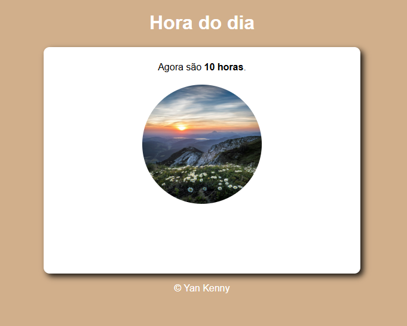
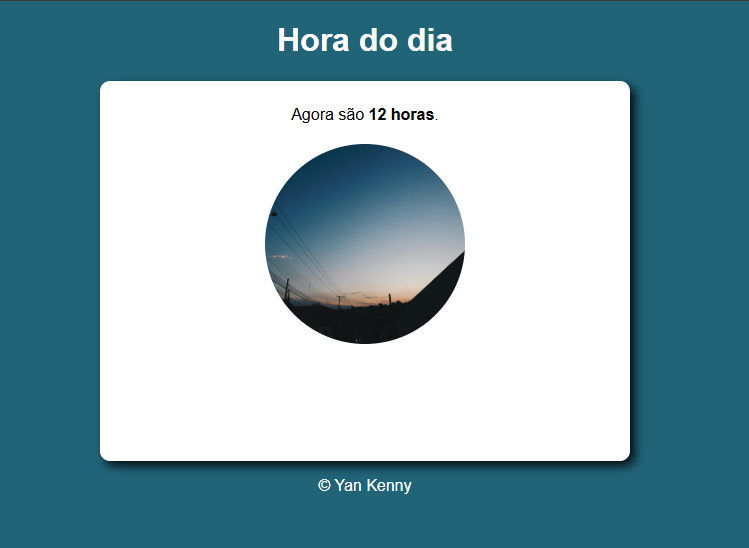
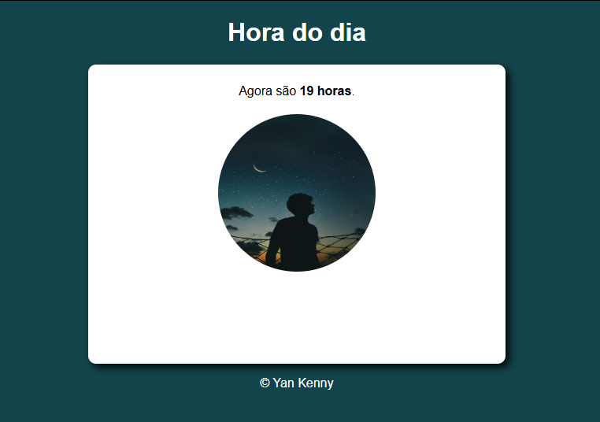

<h1 align="center">Sistema Display Hours</h1>

Bem-vindo ao repositório do código-fonte do meu sistema! Este site foi criado para testar meus conhecimentos em HTML, CSS e Java Script.

**Visite o site:** https://kennyangit.github.io/sistemaExibirHoras/
##
<h1 align="center"> Preview 🖥️ </h1>

<h3 align="center"> Manhã: </h3>

<h3 align="center"> Tarde: </h3>

<h3 align="center"> Noite: </h3>

 

## 🚀 Tecnologias

   
Esse projeto foi desenvolvido com as seguintes tecnologias:  
    
    
    

## 💻 Projeto

  <ul>
    <li>Autor : <a href="https://github.com/kennyangit">Yan Kenny</a>
</li>
    <li>
Proposta: Um site simples que exibe a hora de acordo com a hora do sistema
</li>
   </ul>
   

